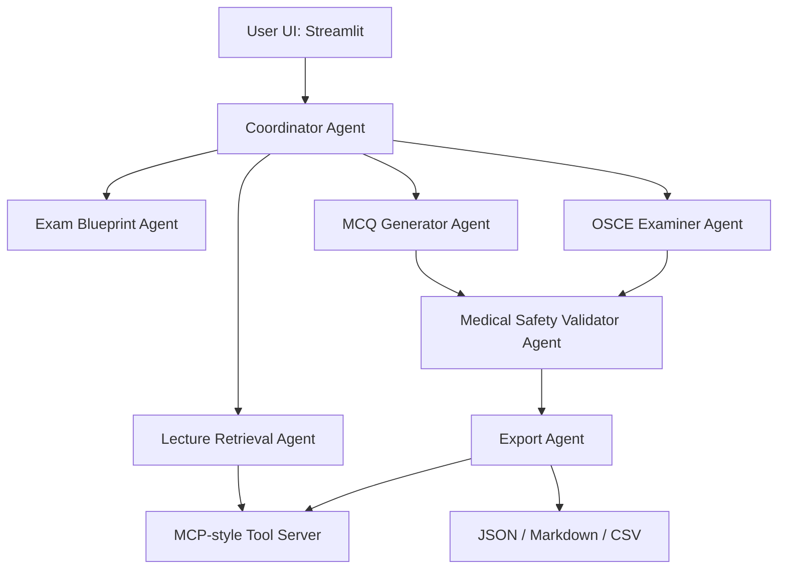

# MedTutor Agent

MedTutor Agent converts lecture PDFs or pasted medical notes into source-grounded exam practice: MCQs, OSCE stations, study blueprints, validation reports, and downloadable files.

## Problem

Medical students often have dense lecture PDFs but need active recall, clinically framed questions, and a way to check whether generated questions are grounded in the lecture.

## Solution

This project implements a focused multi-agent demo:

- Coordinator Agent routes the workflow.
- Lecture Retrieval Agent chunks and searches source material.
- Exam Blueprint Agent extracts high-yield topics and exam angles.
- MCQ Generator Agent creates five-option questions with explanations.
- OSCE Examiner Agent creates oral exam stations.
- Medical Safety Validator Agent checks prompt-injection, possible PHI, option quality, and grounding.
- Export Agent saves JSON, Markdown, and CSV outputs.

The app is deterministic and works offline by default, so the demo does not require storing API keys in the repository. `.env.example` is included for future Gemini or ADK integration.

## Architecture



## MCP Tools

The local tool layer exposes MCP-style functions:

- `search_lecture(query)` through `tools.lecture_tools.search_lecture`
- `get_lecture_chunk(chunk_id)` represented by chunk IDs and source citations
- `generate_output_file(filename, content)` in `tools.export_tools`
- `validate_no_phi(text)` in `tools.security_tools`

## Security Features

- `.env` is ignored and `.env.example` contains only placeholders.
- Uploaded or pasted text is scanned for prompt-injection phrases.
- Text is scanned for common PHI patterns such as emails, phone numbers, MRNs, national IDs, patient names, and address-like strings.
- Every output includes an educational-only medical disclaimer.
- MCQs are checked for five options, one best answer, explanations, sources, duplicates, and grounding.

## Installation

```bash
python -m venv .venv
.venv\Scripts\activate
pip install -r requirements.txt
```

## Running Locally

```bash
streamlit run app.py
```

## Demo

1. Open the app.
2. Use the sample respiratory lecture or upload a PDF/TXT file.
3. Choose MCQs, OSCE cases, study blueprint, or validation.
4. Run the workflow.
5. Inspect the agent trace and download JSON, Markdown, or CSV output.

## Sample Outputs

Running the app or tests writes files into `outputs/`, including:

- `questions.json`
- `mcqs.md`
- `mcqs.csv`
- `osce_cases.md`
- `study_plan.md`

## Limitations

- The current generator is deterministic and heuristic rather than LLM-powered.
- PDF extraction depends on PyMuPDF and works best on text-based PDFs.
- Safety checks are pattern-based and should be treated as guardrails, not a compliance system.
- The tool is for education and exam preparation only, not patient care.

## Future Work

- Add Google ADK and Gemini-backed generation as an optional provider.
- Add spaced repetition and Anki export.
- Add multilingual lecture support.
- Add richer source-grounding scores and reviewer feedback loops.

